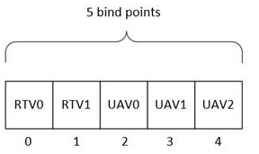

# PFND3D11DDI_SETRENDERTARGETS callback function

## -description

The **SetRenderTargets(D3D11)** function sets render target surfaces.

## -parameters

### -param Arg1

[in] **hDevice**: A handle to the display device (graphics context).

### -param Arg2

[in] **phRenderTargetView**: An array of handles to the render target view (RTV) objects to set. Note that some handle values can be **NULL**.

### -param NumRTVs

[in] The number of elements in the array provided in **phRenderTargetView** for the RTVs to set.

### -param ClearSlots

[in] The number of RTV objects to unbind; that is, those render target view objects that were previously bound but no longer need to be bound.

### -param Arg5

[in] **hDepthStencilView**: A handle to the depth-stencil buffer to set.

### -param Arg6

[in] **phUnorderedAccessView**: An array of handles to the unordered access view (UAV) objects to set.

### -param Arg7

[in] **pUAVInitialCounts**: An array of append and consume buffer offsets. This parameter is only relevant for UAVs of the **phUnorderedAccessView** array that were created with either **D3D11_DDI_BUFFER_UAV_FLAG_APPEND**  or **D3D11_DDI_BUFFER_UAV_FLAG_COUNTER** set in the **Flags** member of the [**D3D11DDIARG_BUFFER_UNORDEREDACCESSVIEW**](ns-d3d10umddi-d3d11ddiarg_buffer_unorderedaccessview.md) structure when the UAV was created; otherwise, it is ignored. If an element in this array is set to -1, the current offset for that append and consume buffer should be kept. Any other value causes the driver to set the hidden counter for that UAV append and consume buffer.

### -param UAVStartSlot

Index of the first UAV to bind. **UAVStartSlot** must be at least as great as the **NumRTVs** parameter.

> [!NOTE]
> Only one shared set of binding points exists for RTVs and UAVs. RTVs are bound first, followed by UAVs.

### -param NumUAVs

[in] The number of UAVs to bind.

### -param UAVRangeStart

[in] The first UAV in the set of all updated UAVs (which includes **NULL** bindings).

### -param UAVRangeSize

[in] The number of UAVs in the set of all updated UAVs (which includes **NULL** bindings).

## -remarks

Resource descriptors such as RTVs and UAVs must be bound (put in *input slots*) before shaders can access them for read or write.

The following image shows an example with five resources.

In the above example:

* **NumRTVs** = 2
* **UAVStartSlot** = 2
* **NumUAVs** = 3

**NumUAVs** and  **UAVStartSlot** specify which range in the UAVs array contains changes in relation to the state that was previously bound. Note that the points in the range could be *unchanged*.

The **UAVRangeStart** and **UAVRangeSize** parameters are a convenience that reveal the span of what actually *changed* given that the Direct3D DDI always binds everything (including what has not changed). The D3D11 runtime formulates them on the application's behalf as additional information for driver writers as hints for possible optimization. Typically, the D3D11 runtime will call this function with **UAVRangeStart** and **UAVRangeSize** values to indicate the whole range. Using the above example:

* To choose the whole range (no change believed to happen), **UAVRangeStart** = 2 and **UAVRangeSize** = 3.
* To indicate that just the first UAV might have changed, **UAVRangeStart** = 2 and **UAVRangeSize** = 1.

The driver can use the [**pfnSetErrorCb**](nc-d3d10umddi-pfnd3d10ddi_seterror_cb.md) callback function to set an error code.

The driver should not encounter any error, except for D3DDDIERR_DEVICEREMOVED. Therefore, if the driver passes any error, except for D3DDDIERR_DEVICEREMOVED, in a call to the [**pfnSetErrorCb**](nc-d3d10umddi-pfnd3d10ddi_seterror_cb.md) function, the Microsoft Direct3D runtime will determine that the error is critical. Even if the device was removed, the driver is not required to return D3DDDIERR_DEVICEREMOVED; however, if device removal interfered with the operation of **SetRenderTargets** (which typically should not happen), the driver can return D3DDDIERR_DEVICEREMOVED.

## -see-also

[**D3D11DDIARG_BUFFER_UNORDEREDACCESSVIEW**](ns-d3d10umddi-d3d11ddiarg_buffer_unorderedaccessview.md)

[**D3D11DDI_DEVICEFUNCS**](ns-d3d10umddi-d3d11ddi_devicefuncs.md)

[**pfnSetErrorCb**](nc-d3d10umddi-pfnd3d10ddi_seterror_cb.md)
