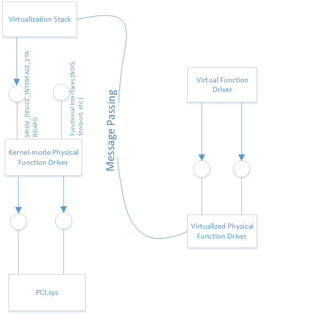

# Pcivirt.h header


## -description

Reference guide for using interfaces used exposing VFs to a Virtual Machine.

Devices that conform to the PCI Express Single-Root I/O Virtualization (SR-IOV) specification can provide multiple interfaces to the device. These interfaces, known as Virtual Functions (VFs), are independent and are provided through the initial device interface, known as the Physical Function (PF). For example, an Ethernet NIC that supports SR-IOV can be designed to have a switch with one physical Ethernet port (connected to the physical wire) and many virtual Ethernet ports. 

The PF’s configuration space allows the PF driver to manage the VF's PCI resources, including memory-mapped I/O space and message-signaled interrupts. Since VFs are a subset of a complete device, they can be less expensive to expose in hardware than a traditional function in a multi-function package. This allows the device maker to build more interfaces, and to manage any shared resources centrally.

When Windows is running directly on the machine hardware, the device drivers participate in operations related to Plug and Play, power management, interrupt management and other tasks. A trusted Windows bus driver and Hardware Abstraction Layer (HAL) own bus configuration and configure the entire bus. The driver runs within the same privilege level and there are no trust boundaries in kernel mode. 

When Windows is running on a virtual machine (VM), those assumptions do not apply. VFs can be put under the control of a non-privileged VM. However, the hardware must be security checked so that the security or performance of the system is not impacted. 

When a driver running on the VF requests a configuration space read or write, the request is received by the virtualization stack and sent to the SR-IOV device’s PF driver. It is the responsibility of the PF driver to respond to those requests and provide details for the VF. The PF driver may occasionally require that a configuration read or write request that is passed down to the hardware. 

The stack uses an I/O MMU to differentiate traffic coming from the various interfaces that the device exposes, enforcing policy about which regions of memory a device can access and which interrupts it can generate.



 
## Hardware requirements
The system to be used for SR-IOV device assignment must meet the requirements for SR-IOV networking and Direct Device Assignment. The system must have a IOMMU, that IOMMU must be configured to give control of devices over to the operating system, and PCIe ACS (Access Control Services) must be enabled and configured for use by the operating system.  Finally, the device in question must not use line based interrupts, and must not require ATS (Address Translation Services).

More information here:

[Everything you wanted to know about SR-IOV in Hyper-V. Part 1](/archive/blogs/jhoward/everything-you-wanted-to-know-about-sr-iov-in-hyper-v-part-1)

[Discrete Device Assignment — Description and background](https://techcommunity.microsoft.com/t5/Virtualization/bg-p/Virtualization)

To determine if a system supports device assignement, and if a particular PCI device will work for device assignment:

[Discrete Device Assignment script](https://github.com/MicrosoftDocs/Virtualization-Documentation/blob/live/hyperv-tools/DiscreteDeviceAssignment/SurveyDDA.ps1)

## Querying for SR-IOV devices

GUID_DEVINTERFACE_VIRTUALIZABLE_DEVICE is a device class interface that is provided by drivers for SR-IOV devices. This GUID provides a way to query for all the device stacks which expose the various function tables that are used to manage the virtualization-related features of the device. After the driver registers the GUID, individual capabilities are discovered by sending IRP_MN_QUERY_INTERFACE. The driver must respond to that request with GUID_SRIOV_DEVICE_INTERFACE_STANDARD. Drivers must also handle IOCTL_SRIOV_NOTIFICATION and IOCTL_SRIOV_EVENT_COMPLETE.

A driver for an SR_IOV device, which runs in a privileged VM is the host OS. It owns Plug-and-Play and power management for a entire machine, and exposes PCI Express SR-IOV Virtual Functions in non-privileged VMs, must provide the GUID_SRIOV_DEVICE_INTERFACE_STANDARD (defined in the header Pcivirt.h). That driver might be PCI Express SR-IOV Physical Function (PF) driver that creates the FDO, or it might be a lower filter on that device node in the case when the FDO is being managed by a port driver.

The device interface is required so that the driver can access the configuration space of the VFs.

In the PF driver's EVT_WDF_DRIVER_DEVICE_ADD implementation, perform these tasks:

- After calling WdfDeviceCreate to create the function device object (FDO), call WdfDeviceCreateDeviceInterface to register GUID_DEVINTERFACE_VIRTUALIZABLE_DEVICE. This allows the virtualization stack to retrieve a device handle to the SR-IOV device.
- Expose the GUID_SRIOV_DEVICE_INTERFACE_STANDARD. 
    - Initialize a SRIOV_DEVICE_INTERFACE_STANDARD structure and set members to function pointers of the callback functions implemented by the PF driver.
    - Configure the structure by calling WDF_QUERY_INTERFACE_CONFIG_INIT.
    - Register the interface with the FDO by calling WdfDeviceAddQueryInterface. 

```
    // Make the device visible as an assignable device.
    //
    status = WdfDeviceCreateDeviceInterface(
        fdo,
        &GUID_DEVINTERFACE_VIRTUALIZABLE_DEVICE,
        NULL);
    if (!NT_SUCCESS(status))
    {
        TraceEvents(TRACE_LEVEL_ERROR, DBG_INIT,
                    "Failed to create interface: %!STATUS!",
                    status);
        goto Cleanup;
    }

    //
    // Expose SRIOV_DEVICE_INTERFACE_STANDARD
    //
    RtlZeroMemory(&sriovInterface, sizeof(sriovInterface));
    sriovInterface.Size = sizeof(sriovInterface);
    sriovInterface.Version = 1;
    sriovInterface.Context = deviceContext;
    sriovInterface.InterfaceReference = Virtualization_ReferenceInterface;
    sriovInterface.InterfaceDereference = Virtualization_DereferenceInterface;
    sriovInterface.ReadVfConfig = Virtualization_ReadConfig;
    sriovInterface.WriteVfConfig = Virtualization_WriteConfig;
    sriovInterface.ReadVfConfigBlock = Virtualization_ReadBlock;
    sriovInterface.WriteVfConfigBlock = Virtualization_WriteBlock;
    sriovInterface.ResetVf = Virtualization_ResetFunction;
    sriovInterface.SetVfPowerState = Virtualization_SetPowerState;
    sriovInterface.GetDeviceLocation = Virtualization_GetDeviceLocation;
    sriovInterface.GetVendorAndDevice = Virtualization_GetVendorAndDevice;
    sriovInterface.QueryProbedBars = Virtualization_QueryProbedBars;
    sriovInterface.QueryLuid = Virtualization_QueryLuid;


    WDF_QUERY_INTERFACE_CONFIG_INIT(&qiConfig,
                                    (PINTERFACE)&sriovInterface,
                                    &GUID_SRIOV_DEVICE_INTERFACE_STANDARD,
                                    NULL);

    status = WdfDeviceAddQueryInterface(fdo, &qiConfig);

    if (!NT_SUCCESS(status))
    {
        TraceEvents(TRACE_LEVEL_ERROR, DBG_INIT,
                    "WdfDeviceAddQueryInterface failed: %!STATUS!\n",
                    status);
        goto Cleanup;
    }

```
## Handling Plug and Play events

The virtualization stack is responsible for sending the appropriate messages to the VM, waiting for the reply (with a timeout) and in case of non-responding VM, and applying appropriate action such as vetoing the PnP event, or surprise-removing the device from the non-privileged VM. PF drivers that implement GUID_DEVINTERFACE_VIRTUALIZABLE_DEVICE must also handle these I/O control requests that allow the virtualization stack to react to PnP events. 

- The virtualization stack first sends IOCTL_SRIOV_ATTACH to the device. This notifies the device that the virtualization stack needs to be notified about certain PnP events. 

- This is in effect until the virtualization stack sends IOCTL_SRIOV_DETACH. 

- The virtualization stack queries the devices about PnP events by sending IOCTL_SRIOV_NOTIFICATION requests. The PF driver can inform the virtualization stack of a PnP event by completing the IOCTL_SRIOV_NOTIFICATION request.

- The virtualization stack unblocks those events by sending IOCTL_SRIOV_EVENT_COMPLETE.

