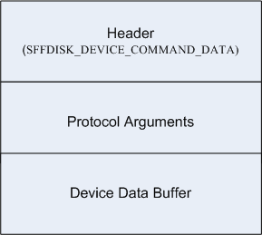

## -description

The SFFDISK\_DEVICE\_COMMAND\_DATA structure specifies the operation performed by an [**IOCTL\_SFFDISK\_DEVICE\_COMMAND**](ni-sffdisk-ioctl_sffdisk_device_command.md) request.

## -struct-fields

### -field HeaderSize

The length, in bytes, of the header structure. The size does not include any data concatenated at the end. The caller should initialize this field to **sizeof** (SFFDISK\_DEVICE\_COMMAND\_DATA).

### -field Flags

Reserved.

### -field Command

Contains an enumeration value of type [**SFFDISK\_DCMD**](ne-sffdisk-sffdisk_dcmd.md) that defines the type of operation. Typical operations include retrieval of the card's security level, device commands, and locking (or unlocking) the interface channel as a preliminary action to a series of commands.

### -field ProtocolArgumentSize

The length in bytes of the device command arguments that immediately follow this header structure. This data begins at the address indicated by the **Data** member. Device command arguments are specific to the protocol of the device.

### -field DeviceDataBufferSize

Defines the length, in bytes, of the data transfer.

### -field Information

On output, this member contains an operation-dependent status value.

### -field Data[0]

Buffer that contains the command arguments.

## -remarks

The following diagram indicates the layout of the data submitted with an [**IOCTL\_SFFDISK\_DEVICE\_COMMAND**](ni-sffdisk-ioctl_sffdisk_device_command.md) request. The caller of this request stores this data at the location indicated by the **Data** member of the SFFDISK\_DEVICE\_COMMAND\_DATA structure:

The format of the protocol arguments depends on the protocol that the device uses. For an SD storage device, the protocol arguments section will contain an [**SDCMD\_DESCRIPTOR**](../sddef/ns-sddef-_sdcmd_descriptor.md).

## -see-also

[**IOCTL\_SFFDISK\_DEVICE\_COMMAND**](ni-sffdisk-ioctl_sffdisk_device_command.md)
